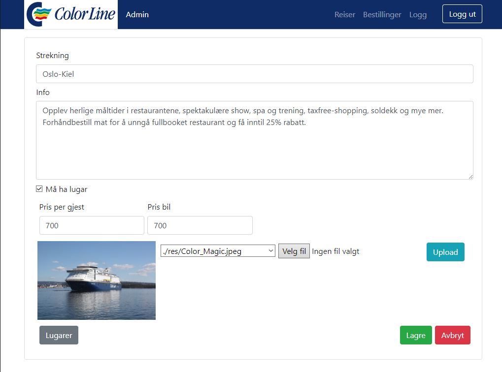

# Gruppeoppgave 2 - Administrere båttur

## Introduksjon

Som oppgaven ville så tok vi prosjektet fra gruppeoppgave 1 og utvidet på det. Det første vi
gjorde var å gjenskape det til et fullstack Angular prosjekt med TypeScript i stedet for
JavaScript. Det er ikke gjort så mye med en vanlig brukers opplevelse av applikasjonen, men det
som er nytt er tilføyelsen av administrator tilgang. Her har administrator full kontroll og
kan enkelt endre på reiser, bestillinger og alt vedkommende kunne ville endre på.

## Påloggingsinformasjon

Du kommer til innlogging ved https://localhost:5001/admin (gitt at serveren kjører på
maskinen din)
- Brukernavn: admin
- Passord: admin

## Implementasjon av administrator (backend)

I motsetning til frontend så måtte vi ikke omstrukturere hele prosjektet, og vi trodde det var
minimalt vi måtte gjøre her. Vi satt inn modell, controller, interface og repo til bruker
(admin). Vi kom på etter hvert at når man returnerer brukeren til frontend, så er det ikke
veldig sikkert når passordhash og salt returneres med bruker objektet. Dette er grunnen til
at vi også så det som nødvendig å implementere en DTO bruker som returneres med kun nødvendig
informasjon.

Metoden for å lage salt og hashe passsord, samt generelt håndtere passord er gjort slikt som
videoen på canvas sier det skal være gjort.

For å laste opp bilder fra frontend til backend og server, måtte vi lage en egen controller.
Denne controlleren tar i mot et request av typen multipart/form-data. Når denne filen blir
mottatt åpnes det en filestream til en bestemt mappe med filnavnet til innkommende fil.
Filestreamen blir flushet når filen er ferdig opplastet og url-en til bildet legges til i
databasen. Til slutt returneres linken til bruker. Mye av inspirasjonen til denne spesifikke
koden er hentet fra https://code-maze.com/upload-files-dot-net-core-angular/. Også kildet
nederst under Kilder seksjonen.

## Implementasjon og interaksjon til administrator (frontend)

Angular er selvfølgelig komponentbasert. Dette medfører at etter at vi hadde omgjort det fra
oppgave 1. så delte vi admin til en egen side. Hvis du går inn på 
https://localhost:5001 (når serveren kjører) havner du dit du kom på oppgave 1, mens du må
til https://localhost:5001/admin for å komme til de nye funksjonene. Vel å merke har du kun
tilgang til innloggings siden og  innloggings komponenten med mindre du er logget inn.
Det seedes til databasen ved oppstart av serveren en bruker med navn og passord admin.

For å gjøre det enklere så er det lagt til en footer til den vanlige brukers del av nettsiden
der man kommer inn på administrator delen.

Administrator har fått sin egen meny, og har herfra tilgang til å se og å administrere:
- Reiser
- Bestillinger
- Brukere

I tillegg kan administratorer se en pent framvist logg av alle databaseendringer. Som bonus
har vi også lagt til muligheten for å søke i denne loggen basert på enten hvilken 
administrator som gjorde endringene, når endringene ble gjort eller på beskrivelse av hva 
slags endring som er gjort. Dette tenkte vi var en god "quality of life" addisjon siden
en slik logg kan bli meget lang etter en stund.

I reiser komponenten har vi listet opp alle reiser fra databasen i kort. Alle kortene viser
hvilken strekning og gir en knapp for å redigere eller slette. Velger man å slette har vi
implementert en modal som forsikrer at administrator faktisk ønsker å slette. Denne forsikringen
finnes alle steder man kan slette. 

Velger man å redigere en strekning vil man få opp en ny komponent med all informasjon til
strekningen i input felt klart til å redigeres. Man kan også laste opp nytt bilde som legges
automatisk i wwwroot/res mappen. Trykker man på lugar får man lignende muligheter som på
opplistingen av strekninger. Til slutt har vi gitt en lagre knapp som åpenbart lagrer det som
ligger i input-feltene til den utvalgte strekningen, eller så har du en avbryt knapp som sender
deg tilbake til den forrige komponenten uten endringer. Trykker du på "lag ny reise" knappen, 
så får du det samme som på rediger strekning, bare at alle input felter er tomme og det lagres
en ny strekning til databasen ved lagring.

I bestillinger komponenten er det opplistet pent i en table alle bestillinger med den mest
nødvendige informasjonen. Man har også her tilgang til de blå og røde endre og slette knappene.
Endrer man her, så fungerer det likt som ved endring av reise, bare at det er et
bestillingsobjekt.

Vet ikke hvor nødvendig det var, men vi la også til muligheten for å endre passord, legge til og
slette brukere. Som en liten sikkerhet la vi også til frontend validering slik at man ikke 
kan slette den brukeren man er innlogget på. Slik er det alltid en administrator konto på
databasen.

Når administrator er ferdig med sitt kan vedkommende enkelt logge ut med en lett og alltid
tilgjengelig logg-ut-knapp.

## Logg

Logging har fått et eget repo som injectes i alle andres repository. Når en logg lages, så tar
den inn en beskjed. Brukeren den logges på hentes fra session. Tiden settes ved insert i
databasen.

Dette kalles ved publisering, endring og sletting av administrativ art i tillegg til alle
innlogginger.

## Enhetstester

Er ikke så mye å fortelle annet enn at det har blitt laget 63 enhetstester som tester 
alle metoder fra controllerene. De fleste metoder testes fra 2-3 ganger ettersom vi ikke 
bare sjekker der OK sendes, men også ved Unauthorized og BadRequest. Alle testene får Success.

## Mål og krav oppgaven spør etter (som vi mener er implementert)

### Funksjonalitet

#### Innhold

- Administrasjon av de entitetene vi hadde fra oppgave 1
- Innloggingsmekaninsme for admin-brukere
- Logging av endringer til database

#### Veklegging

- Design

Her har vi beholdt det grunnleggende design, tema og layout fra oppgave 1 som vi mente fungerte
godt.

- Ryddig og forståelig kode

Backend er så å si det samme med unntak av koden for bruker og logging. Frontend har jo blitt
omgjort til Angular. Når det er komponentbasert slik så ligger jo alt i sine respektive
undermapper. Da er det lett å se hva som er hva, men vi har lagt til kommentarer det vi har
sett det nødvendig. 

- Kompletthet av enhetstester

Vi har tester som alle går igjennom.

## Skjermbilder

#### Innlogging

#### Innlogget velkomst

### Reiser og alle underkomponenter av reiser

#### Reiser liste

#### Reiser rediger

#### Reiser rediger lugar

#### Reiser rediger lugar opprett

#### Reise delete

### Bestilling skjermbilder

#### Bestilling liste

#### Bestilling endre

#### Bestilling endre kontakt

### Bruker skjermbilde

### Logg skjermbilder

#### Logg liste eksempel

#### Logg søk eksempel

## Kommentarer om valg vi har tatt

- Vi valgte Angular over React av flere grunner.
    - Fordi det undervises i faget
    - Det har routing og httpclient innebygd
    - Vi har brukt React tidligere, men ikke Angular
- Vi har brukt ikoner som søppelkasse og blyant ettersom dette er ganske universelt forstått og
brukervennlig, selvfølgelig også i kombinasjon med farge til bakgrunnen.
- Vi har valgt å logge til database for å vise i admin-modulen vår. Dette tenkte vi var mye
penere og nyttigere
- I logge siden har vi søke funksjon som da også en "quality of life" funksjon som gjør ting
mye lettere

## Kilder

- Color line
- bootstrap
- https://code-maze.com/upload-files-dot-net-core-angular/